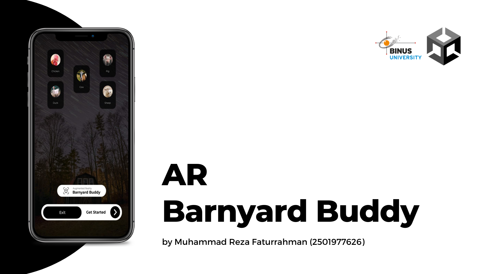

# AR Barnyard Buddy

AR Barnyard Buddy adalah aplikasi Android dengan dukungan ARCore dan Unity yang memungkinkan pengguna untuk dapat belajar mengenai hewan apa saja yang terdapat di dalam peternakan.

## 3D Model Hewan

Nantinya, akan terdapat 5 hewan yang tersedia dan secara umum diternak yaitu sebagai berikut:

- Ayam,
- Babi,
- Bebek,
- Domba, dan
- Sapi.

Sumber 3D Model : [Farm Animals Set](https://assetstore.unity.com/packages/3d/farm-animals-set-97945)

## Rencana Pengembangan

- Proyek Awal. ✅
- Menambahkan Scene Home, Menu, dan Information. ✅
- Menambahkan Scene Chicken Intro, Chicken Play, dan Chicken Quiz. ✅
- Menambahkan Scene Cow Intro, Cow Play, dan Cow Quiz. ✅
- Menambahkan Scene Duck Intro, Duck Play, dan Duck Quiz. ✅
- Menambahkan Scene Pig Intro, Pig Play, dan Pig Quiz. ✅
- Menambahkan Scene Sheep Intro, Sheep Play, dan Sheep Quiz. ✅
- Mengubah Icon atau Logo dan Versi Aplikasi. ✅

## Mockup

Figma : [Wireframes + Mockup](https://www.figma.com/file/TAQwvDCydVR2ErZxGxT96N/Wireframe-%26-Mockup-AR-Barnyard-Buddy-UTS?node-id=1%3A8&t=dmHPltwQyLqECHsy-1)

## Aplikasi

v1.0 : [Download](https://drive.google.com/file/d/1xOnAWM-wA6wiQ5_9Y4kgJ3uXvqFOoinT/view?usp=share_link)

## Persyaratan Sistem

- Minimal Android 8 "Oreo".
- Pastikan SmartPhone Anda dapat menjalankan atau kompatibel dengan syarat terdapat "Google Play Services for AR" di Play Store Anda.

## Demo

YouTube : [Klik Disini](https://youtu.be/B2v3hKRhJEM)
